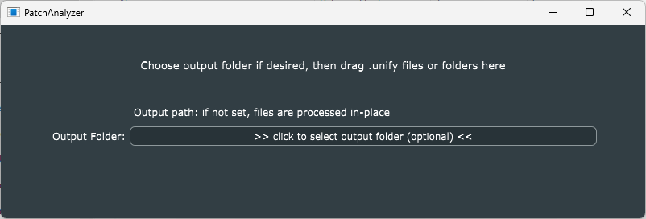

# PatchAnalyzer

This is a tool to help you understand the structure of complex Unify patches. Note it only works with unencrypted *.unify* files. If you need to analyze a patch saved as an encrypted *.gpf* file, open the patch in Unify and save a copy of it to e.g. your User library--the copy will be saved as a *.unify* file.

To use this tool, simply drag/drop a *.unify* file onto the GUI. The program will produce a new file with the same name, but extension *.txt*, containing an outline of the patch's structure.

- By default, the *.txt* file will go into the same folder as the *.unify* file.
- If you'd like the output to go to a specific folder, click the "Output Folder" button, navigate to the folder you want to use for new *.txt* files, and click OK, before dragging in *.unify* files.
- You may select multiple *.unify* files in Finder/Explorer and drag them all in, or you can drag in an entire folder containing multiple *.unify* files, to process several patches in a batch.

## Example 1

Consider the *Arrival - I - MIDI Files Before Unify* patch from the Unify Standard Library. Its contains all four types of layers (six layers in total), and appears like this in Unify:

If you re-save this patch as a *.unify* file and drop it into PatchAnalyzer, the app will produce a file called *Arrival - I - MIDI Files Before Unify.txt* like this:

`Patch name: Arrival - I - MIDI Files Before Unify`

`MIDI1:` 
    `m MIDIBox [Built-In]`

`INST1: Dream Strings Combo`
    `i Guru Sampler [Built-In]`

`INST2: FM Harp 6`
    `i Dexed [VST]`
    `a Dragonfly Hall [VST]`

`INST3: Kalamath Pad (Del Norte EDM/Chill)`
    `i Guru Sampler [Built-In]`

`MASTER:` 
    `a WaterVerb [Built-In]`
    `a FlexEQ [Built-In]`
    `a Enforcer [Built-In]`
    `a LoudMax [VST]`

`AUX1:` 
    `a Omega Delay [Built-In]`
    `a WaterVerb [Built-In]`

NOTE that the "Master" layer appears before any AUX layers, rather than at the end as one might expect. This is an artifact of how these layers are saved in Unify patches.

