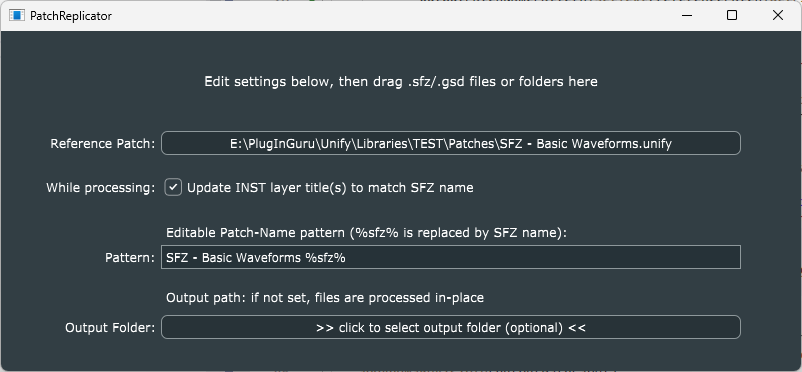

# PatchReplicator

The purpose of this program is to replicate a given reference patch, changing the name of the sample-set referenced in every instance of *Guru Sampler* to the name of a supplied *.sfz* (or *.gsd*) file.

This can be useful in preparing certain "unified" libraries, where multiple versions of a sample-based patch are needed, differing only by the specific sample-set used.

## "While processing" checkbox

If checked, the "while processing, update INST layer title(s) to match SFZ name" checkbox will cause the layer-titles for all affected INST layers to be set to match the selected sample-set name.

## Using the program

- Run the program by double-clicking its icon.
- Click the "Reference Patch" button and select the reference patch file.
  - On both Mac and Windows, this will open a standard file-open dialog
  - On the Mac, you can drag/drop the reference patch file icon directly into the file-open dialog, to automatically navigate to the folder that contains it. Then *double-click* the reference patch file's icon to select it.
  - DO NOT drag/drop the reference patch file into the file-open dialog on Windows. Instead, navigate to wherever it is, and then double-click the reference patch file icon to select it.
  - When you're done, the button text should change to the full path to the reference patch, and the "Pattern" field will be initialized to a usable pattern.
- If you want the INST layer title(s) in all patches to be changed to match the sample-set name, check the box.
- Edit the "Pattern" field, if you wish.
- Drag/drop any number of *.sfz* (or *.gsd*) files, OR their containing folder, into the program window to begin processing those files.
- When processing is done, the "Edit settings below..." text at the top will change to indicate the number of files that were processed.

